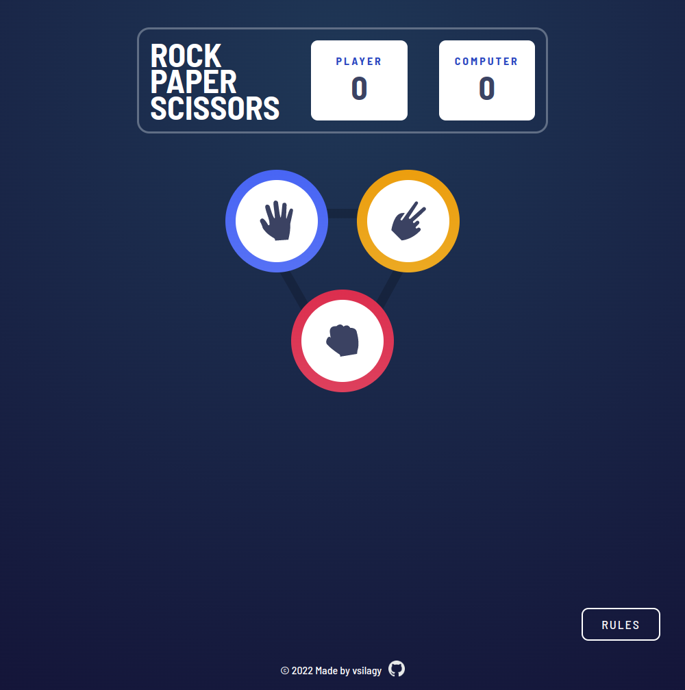

# Rock Paper Scissors

[Live Preview](https://vsilagy.github.io/rock-paper-scissors/)

### **The Odin Project** : [Rock Paper Scissors](https://www.theodinproject.com/paths/foundations/courses/foundations/lessons/rock-paper-scissors) and [Revisiting Rock Paper Scissors](https://www.theodinproject.com/lessons/foundations-revisiting-rock-paper-scissors)

### Objectives:

- build a rock paper scissors game in javascript
- for UI I used [Frontend Mentor](https://www.frontendmentor.io/challenges/rock-paper-scissors-game-pTgwgvgH) JPEG design files, style guide and colors
- _updated the layout, made it responsive_
